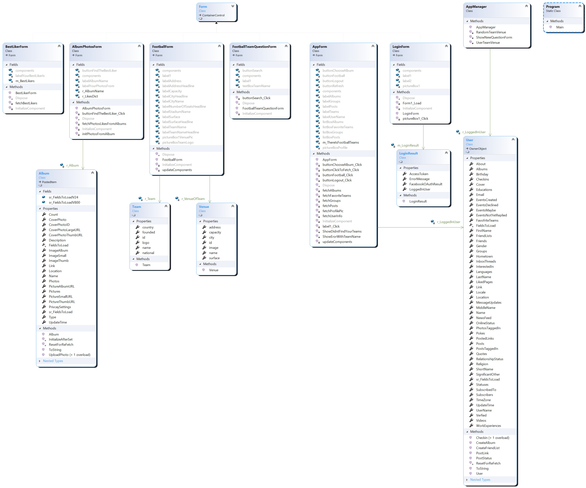

# FaceBookApp_ForWindows
In this project, Omer and I created an app using **C# .Net and FaceBook API.**
The application requests permissions from the user on the initial connection, and uses them to pull data.
The idea was to implement **two new features** that are **NOT** part of FaceBook currently.
The features are:
1. Scanning favorite teams of the user, and give him the option to search any football team in the world, and get array of information about it.
2. Scanning each Album of the user, and find how is the **"best friend"** by several parameters and rules.

As you can see in several parts of the app, we used several **Async function using Task objects** and we implemented
the app using **Design Patterns** such as:
1. Factory method
2. facade
3. Proxy
4. Strategy
5. Observer and more.

Here you can find some of the Class diagrams:

