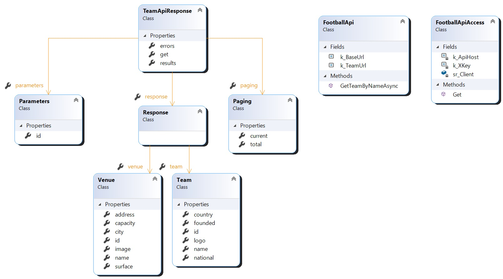

# FaceBookApp_ForWindows
In this project, Omri and I created an app using **C# .Net and FaceBook API.**
This app has access to the Host's data and on that, we implement 
**two new fetchers** that are not part of FaceBook.
1. by searching any Football team in the world you can find information on it like the next game fixers and stadium information.
2. by scanning each Album we find your best friend by several parameters.

As you can see in several parts of the app, we use several **Async function using Task objects** and we implement 
these app by using some **Design Patterns** like:
1. Factory method
2. facade
3. Proxy
4. Strategy
5. Observer and more.

Here you can find some of the Class diagrams:

